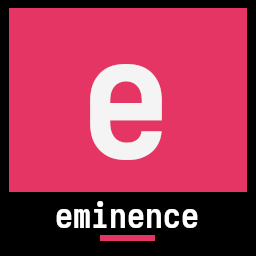
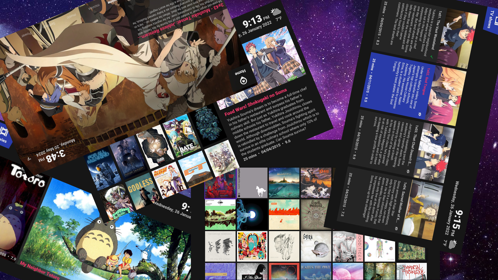
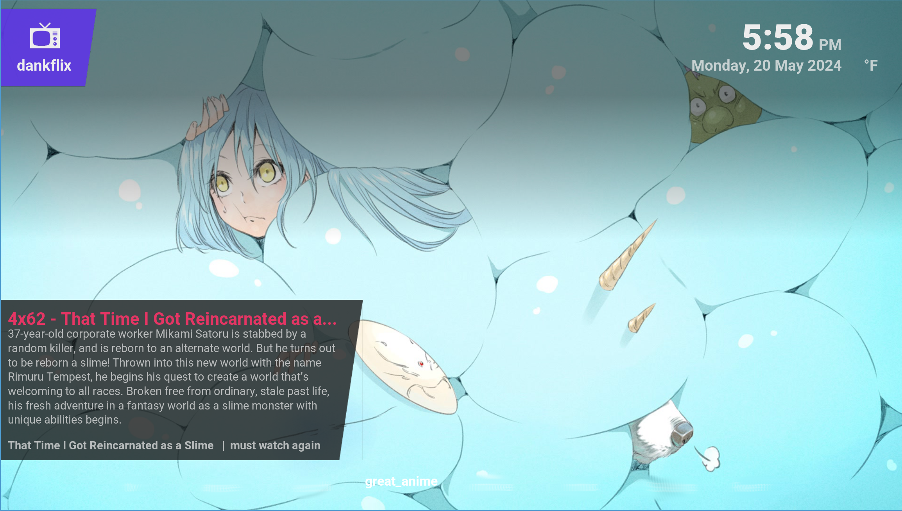
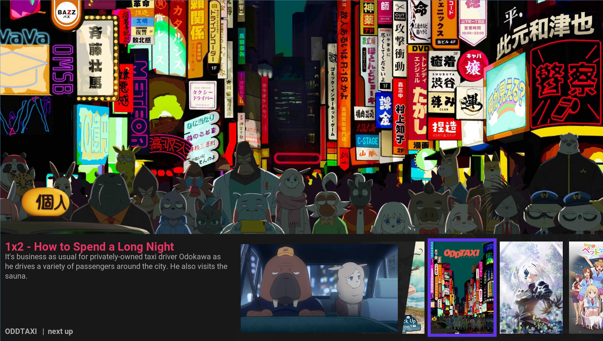
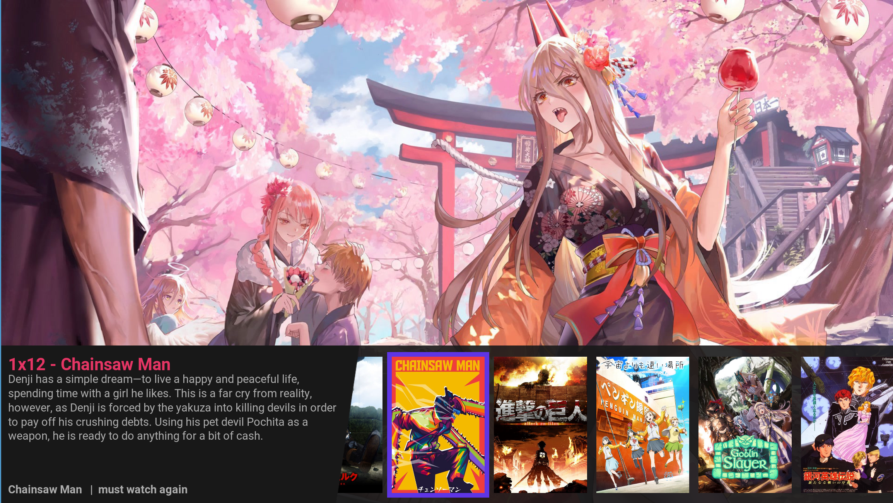
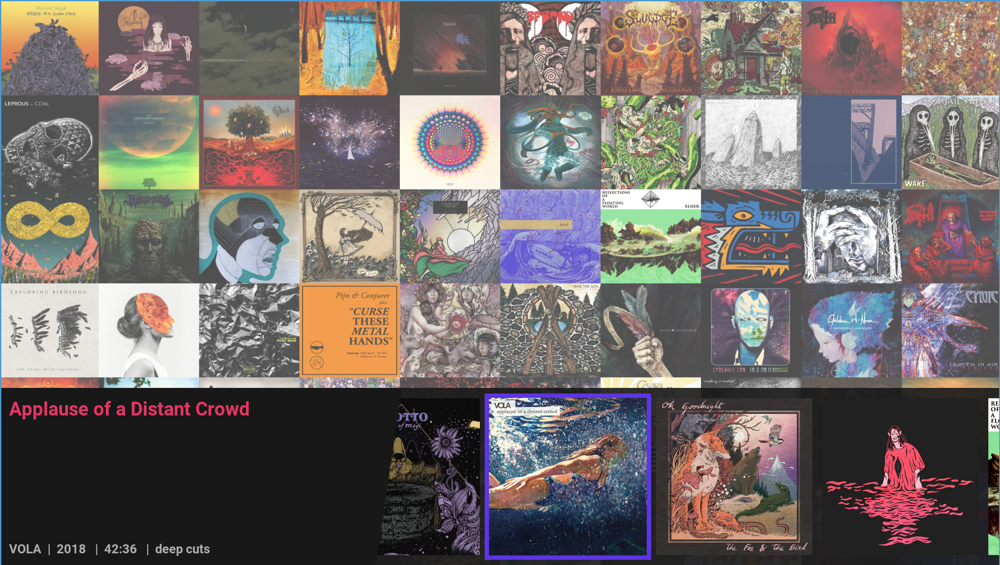
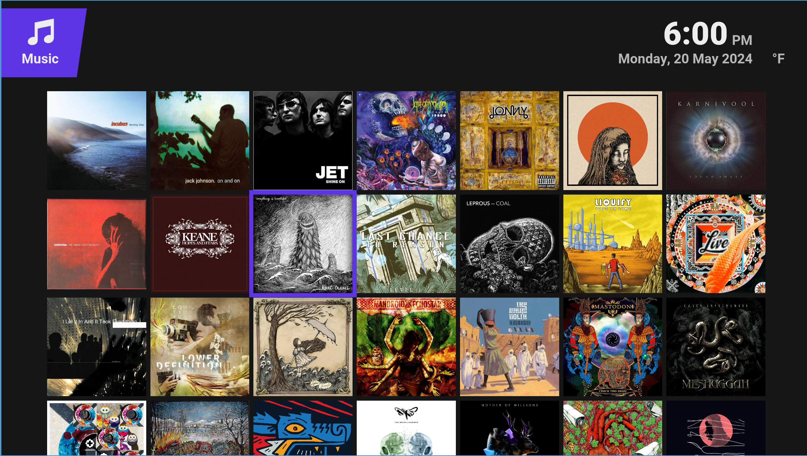
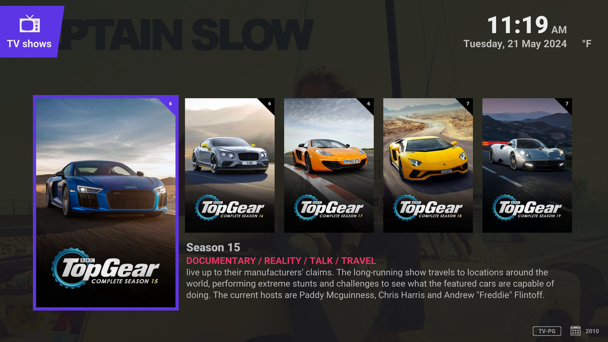
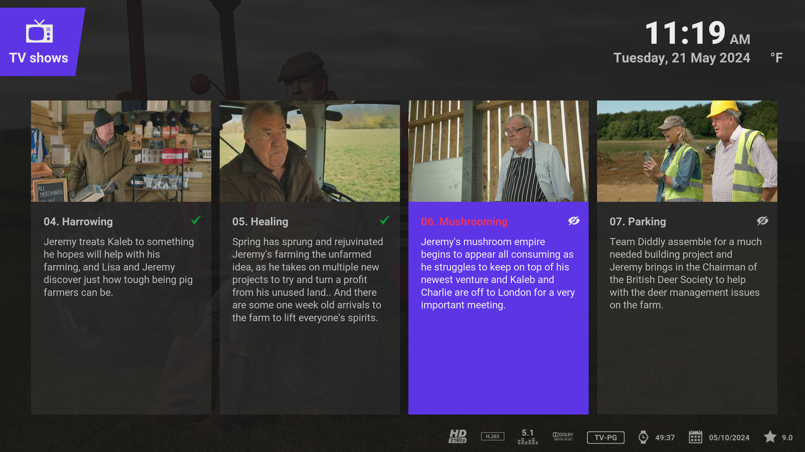

This work is licensed under the Creative Commons Attribution-NonCommercial-ShareAlike 3.0 Unported License.
To view a copy of this license, visit http://creativecommons.org/licenses/by-nc-sa/3.0/
or send a letter to Creative Commons, 171 Second Street, Suite 300, San Francisco, California, 94105, USA.

# Eminence 3!

I've made enough changes to this over the years and have kept updating it to work with newer versions of Kodi. It now is compatible with Omega (Kodi 21) on the master branch and I've decided that now was the time to update the icon. 

You can use this skin by downloading my repo by visiting [here](https://dkoch84.github.io/repository.dkoch84/) or directly by clicking [this link](https://dkoch84.github.io/repository.dkoch84/repository.dank-1.0.0.zip)

### What makes this worthy of '3'?
I use Kodi the way it was always meant to be used, with local media. I also use it on multiple TVs and computers, all with a shared library on MySQL. What's that got to do with a skin? Well, I'm a bit obsessed with art. I choose the artwork for every single movie, tv show, and album in my collection. 

I want to maximize that artwork. Big fanart views, big posters. I also wanted to fit more on the screens to take advantage of higher resolutions (1080p vs 720p). Here's a summary of things I've done to make this uniquely different from Eminence 2:

- Removed themoviedb integration (Trakt integration was noisy and I never used it and could not disable it)
- Fixed BigIcon to use FixedList instead of WrapList which was bugged (I should check if still bugged)
- Added episode thumbs to the widget view when viewing a list of episodes
- Added a "big" widget view for albums
- Added a poster view for video that crams more posters on the screen, and runs off it to emphasize volume
- Added a similar icon view suitable for artists that maximizes the number of icons on the screen. I use my favorite album covers as artist thumbs, so this is a wall of album covers.
- Added a landscape episode view maximizes the space for episode previews/plot
- Added an art-only view that shows only the fanart and the poster
- Tweaked the fonts throughout to cram more content on screen without reducing readability

### Custom Views Refactoring

The custom views have been refactored into separate XML files, preserving the original upstream views while maintaining the custom modifications as standalone views. This makes it easier to update the base skin without losing customizations.

| View ID | Name | Description |
|---------|------|-------------|
| 621 | PosterInfo | Poster grid that crams more posters on screen |
| 622 | Gallerypp | Art-only view showing fanart and poster |
| 623 | AlbumWall | Compact icon grid for artists/albums |
| 624 | Landscape | Horizontal episode view with plot |

These custom views are available in the view selector alongside the original views.

